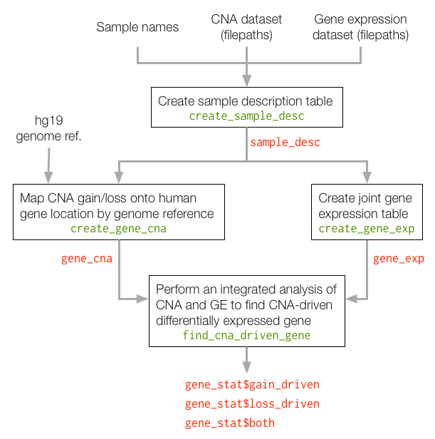

This document guides one through all available functions of the `iGC` package. Package iGC aims to analyze gene expression (GE) and copy number alteration (CNA) (iGC) concurrently.

Traditional CNA analysis method is to investigate different types of samples and integrate their results by Venn diagrams. Challenges arise, however, when the low reproducibility and inconsistency are observed across multiple platforms. To address these issues, iGC tests gene expression profiles and copy number variation simultaneously.

For more information about the method iGC uses, please refer to our publication: Yi-Pin Lai, Liang-Bo Wang, Liang-Chuan Lai, Mong-Hsun Tsai, Tzu-Pin Lu, Eric Y Chuang. iGC--an integrated analysis package of Gene expression and Copy number alteration, *Bioinfomatics* (publication pending).

## General Workflow

The general workflow can be summarized as follows,

Basically there are four steps, corresponding to four R functions, to complete the analysis:

1. Specify sample and their data relations
2. Read and organize gene expression files
3. Read and organize CNA files based on gene regions
4. Identify CNA-driven differentially expressed genes

## Q and As

#### Q: Why required to use the bundled hg19 human genome reference?

In the early phase of development, iGC requires a special data structure for genome reference hence one is bundled. Now no such special structure is required, so we plan to relax such constraint in the coming-up release and user will be able to pass in other references available on Bioconductor.
